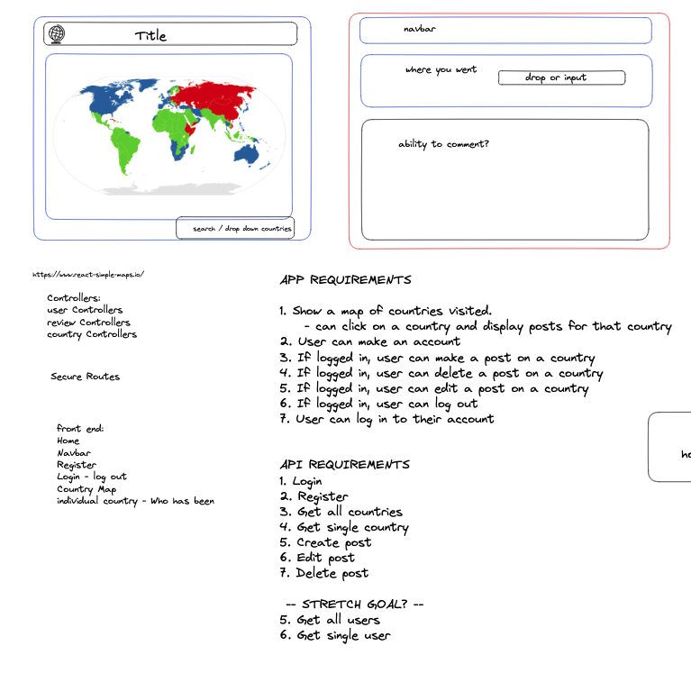
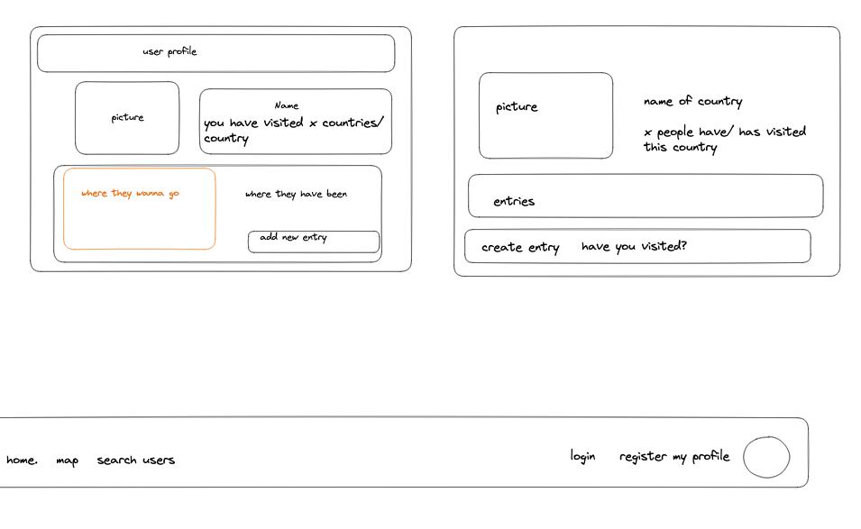
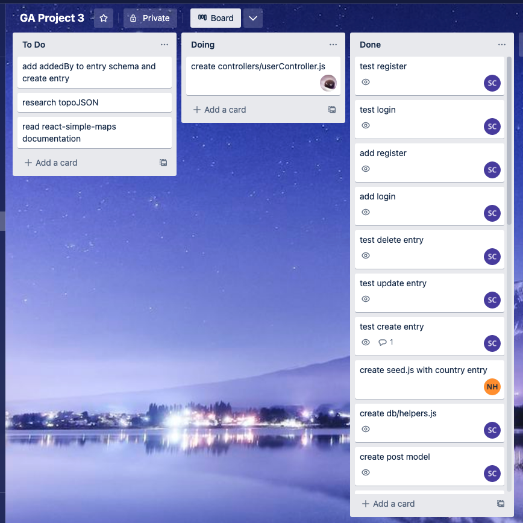

# General Assembly Project 3

## Table of Contents
* [Description](#description)
    - [Deployment Link](#deployment-link)
    - [Code Installation](#code-installation)
    - [Timeframe and Working Team](#timeframe-and-working-team)
    - [Technologies Used](#technologies-used)
    - [Brief](#brief)
* [Planning](#planning)
* [Build Process](#build-process)
    - [Setting up the app](#setting-up-the-app)
    - [Frontend](#frontend)
    - [Backend](#backend)
    - [Stretch Goals](#stretch-goals)
* [Challenges](#challenges)
* [Wins](#wins)
* [Key Learnings](#key-learnings)
* [Bugs](#bugs)
* [Future Improvements](#future-improvements)

## Description

For our third project on the Software Engineering Immersive course at General Assembly, we decided to create an app in which users can make a profile and add posts to countries which they have visited, as well as write about their experience in that country. The user can view a world map which highlights countries in different colours depending on how many people have visited that country. They can then browse the countries and see who else has written about them. We began this project on week 9 of the course, just after completing two weeks of learning Node.js, MongoExpress and React.js. This project intended to put into practice what we had learnt in the preceding weeks.

### Deployment Link

https://sams-adventure-map.netlify.app

### Code Installation
#### For the frontend:
- Make sure that you have installed Node.js.
- Download the code for the frontend onto your local machine.
- Open your terminal and navigate to the root path of the code.
- Run `npm install` then `npm start'
 #### For the backend:
 https://github.com/samcurteis/GA-Project-3-BackEnd
- Repeat the same instructions using the backend repository, except run `npm run dev` instead of `npm start`.

### Timeframe and Working Team

The project timeframe was one week, and was co-created with fellow General Assembly students, Nathan Harris (https://github.com/nedd-ludd) and Toby Hazledine (https://github.com/CodebyJet)

### Technologies Used

The app was built using MongoExpress, React.js and Node.js. It is styled using Material UI components and SASS, and also utilises various packages installed using npm, including Bcrypt, CORS, Dotenv, Buffer and Axios.

### Brief

Our brief was as follows:
- Create a full-stack app using MongoDB, Express, React and Node.js.
- The app must have an authentication function.
- It must include at least two models on the backend and multiple components on the frontend.

## Planning

After writing out a wireframe together which showed a layout of our MVP app, alongside some rough requirements of what we wanted our app to perform. 
<p align='center'>

</p>

<p align='center'>

</p>

We then set up a shared repo and created tickets on Trello to distribute the tasks evenly between the three of us.

<p align='center'>

</p>

## Build Process

### Setting up the app

Immediately starting this project we were able to build most of the app, frontend and backend, within a couple of days. As part of learning how to build MERN stack apps, we had created two already, so by this point getting the bulk of the app built was a fairly straightforward process.

The aspects of the app which went a little slower at this point were those that were unfamiliar to us, namely how to implement an interactive map on our frontend. After a bit of research, we decided to use the react-simple-maps package, which Nathan began the process of implementing.

### Backend

In terms of the backend, it was my job to create the schema for countries and entries, as well as CRUD functionality for entries and entry data in the seed file. This was a rather smooth and painless process, and the only instance I came across where I did not know what to do straight away was when I wanted to log multiple entry ids on the country model, where I had only ever logged one id per model in previous projects. This was quite an easy fix however, as I followed the simple logic of how JavaScript arrays work and tried wrapping the object id in array brackets.

```
import mongoose from 'mongoose';
    
     const countrySchema = new mongoose.Schema({
       name: { type: String, required: true 
       code: { type: String, required: false 
       continent: { type: String, required: false 
       entries: [{ type: mongoose.Types.ObjectId, ref: 'Entry' }] 
                });
    
     export default mongoose.model('Country', countrySchema);
```

This returned exactly what I wanted when I tested it in Postman, so I was able to move on and get through the rest of my backend tasks rather quickly.

### Frontend

For our frontend we decided to use the Material UI library to help us build and style our components. My work mainly focussed on the user index, user page, and some common components for creating entries, searching countries, displaying users on the index and viewing entries on a user profile and country profile.

Displaying an entry card on both user and country pages posed a particular challenge because the data displayed had to be different on both, but the format was the same. On the country page, an entry had to show who made the entry, and on the user page it had to show which country the entry was for. I got around this by embedding ternary operators into what the component returned, and entering ‘null’ for the props which didn’t apply when the component was called.

```
       {addedBy ? (
               <Typography
               sx={{ fontSize: 14, textTransform: 'capitalize' }}
               color='text.secondary'
               gutterBottom
               >
                 Added by {addedBy}:
               </Typography>
             ) : (
               <Typography
              sx={{ fontWeight: 'bold', textTransform: 'capitalize' }}
              color='text.primary'
              gutterBottom
                onClick={navigateToCountry}
              >
                {country?.name}
              </Typography>
            )}
```

The card can then provide different information depending on what information is passed in. On the country page the ‘addedBy’ key is entered, thus displaying one option in the ternary operator.

```
  {!!singleCountry?.entries.length && (
               <Box>
                 {singleCountry?.entries?.map((entry) => (
                   <EntryCard
                     key={entry._id}
                     text={entry.text}
                     addedBy={entry.addedBy.username}
                     countryId={id}
                     entryPic={entry.cloudinaryImageId}
                     userpic={entry.addedBy.cloudinaryImageId}
                    entryId={entry._id}
                    setIsUpdated={setIsUpdated}
                  />
                ))}
```

And on the user page, the `addedBy` is entered as null, thus triggering the alternative option in the ternary operator.

```
  {singleUser?.entries?.map((entry) => (
                   <EntryCard
                     key={entry._id}
                     text={entry.text}
                     addedBy={null}
                     userId={singleUser?._id}
                     userpic={null}
                     country={entry.country}
                     countryId={entry.country?._id}
                     entryPic={entry.cloudinaryImageId}
                    entryId={entry._id}
                    setIsUpdated={setIsUpdated}
                  />
                ))}
```


### Stretch Goals

Having reached our MVP a day in advance I decided to spend the last day implementing one of our stretch goals, which was to have the option for users to tick off countries that they have visited. Each user has a counter for the number of countries they have visited, which was initially represented by how many countries they have written an entry for. I wanted to create a component in which users could tick off the countries they have visited, meaning they didn’t have to write an entry for each country to see how many countries they have visited overall.

To set up this new feature I added another key on the user model in the backend, which represented an array of country ids:

```
vountriesVisited: [[ type: mongoose.Types.ObjectId, ref: 'Country' }],
```

After testing this in Postman, I moved on to implementing it in the frontend. To achieve this I ran an API call for all countries and then created a checkbox for each country using Material UI components:

```
  {availableCountries.map((country) => {
                       return (
                         <FormControlLabel
                           control={
                             <Checkbox
                               checked={formData.countriesVisited.includes(
                                 country._id
                               )}
                               id={country._id}
                               size='small'
                            />
                          }
                          onChange={handleCheckboxChange}
                          label={
                            <Typography sx={{ fontSize: '12px', width: '100px' }}>
                              {country?.name}
                            </Typography>
                          }
                          key={country._id}
                          id={country._id}
                        />
                      );
                    })}
```

If the user has already visited some countries, the box for the countries they have visited is then already logged using the ‘checked’ key on the Checkbox component. I then ran a simple ternary operator within the function for ticking a checkbox, which adds the country to the form data if it isn’t already there, or removes it if it is already there. That form data can then be sent as a put request to update which countries the user has visited.

```
  const handleCheckboxChange = (e) => {
         console.log(e.target.checked, e.target.id);
         setFormData({
           ...formData,
           countriesVisited: formData.countriesVisited.includes(e.target.id)
             ? formData.countriesVisited.filter((i) => i !== e.target.id)
             : [...formData.countriesVisited, e.target.id]
         });
       };
```

## Challenges

The biggest challenge that I think I had with this project was adding all the functionality that we had in mind for the project, as though our target felt within reach, it was at the same time ambitious in the ways that it implemented aspects of functionality that we had never implemented before.

Personally, spending the last day working on a stretch goal had some benefits and drawbacks. I am glad that I worked on this feature as it tested my abilities in creating functional components, but on the other hand, it meant that I was not able to assist my peers in polishing up the app to make sure it was presentable and that all previously created components did not have any bugs.

In having only a day to add this last component, I was also not able to implement it as thoroughly as I would have liked. Deciding whether to have a polished app with less functionality or a more function-rich but less polished app was a difficult dilemma. Overall I am happy with what I learned from the option that I took, but going forward I have tried to make sure that within the timeframe I have for building an app, I take into account time at the end to test and polish up what I have built so that it works exactly in the way that I want it to work.

## Wins

Overall I was very happy with how this project went, as Toby, Nathan and I worked very well together and at no point encountered any blockers or major challenges. This mostly came down to the fact that we stayed in communication with each other throughout the project and were there to give each other a hand whenever we came across a problem we were having trouble figuring out.

This project took place only a few weeks after the previous project that we completed, and I was very happy with the improvement in confidence that I experienced compared to my previous project, both in the planning, teamwork, git management and app-building aspects of the project. I felt like everything ran so much more smoothly.

Although I do not feel that the final result of the project is in any way perfect, for the position I was in at the time I felt that I was able to cover what I knew with relative ease, as well as broach new challenges with an improved sense of confidence, independence and resourcefulness.

## Key Learnings

- This project was extremely useful in helping me to have a better grasp of how to go about working with a team of other developers on a single project, as well as how to go about building a full-stack MERN app. 
- Building a MongoExpress backend was very useful in helping me get to grips with how APIs are structured, making learning new frameworks such as Django much easier. 
- Working with MongoExpress gave me a good context for looking at SQL databases and how their structure compares to the no-SQL database I used in this project. 
- My experience in working with last-minute goals gave me an understanding of when to push for stretch goals and when to hold back to make sure other aspects of the app are more thoroughly developed.

## Bugs

Unfortunately, as adding a checkbox for users to visit came right up to the deadline, it is not yet run through an authenticator which means that it appears on any user page regardless of whether the current user is the same as the user page being viewed, rather than only appearing when the current user is viewing their own page. This would be an easy fix as user authenticators are already implemented in many areas of the app, but I have left the code exactly as it was when we finished the app to show you what we achieved within the week we were given to complete the project.

## Future improvements

Were I to revisit this project I would go through the app to find any bugs that may be present. I would also change the countries visited component to be a little more user-friendly, perhaps offering a dropdown menu rather than checkboxes so that less real estate is required to present the component. I would also have a look at improving the design of the app so that it appears more polished.


